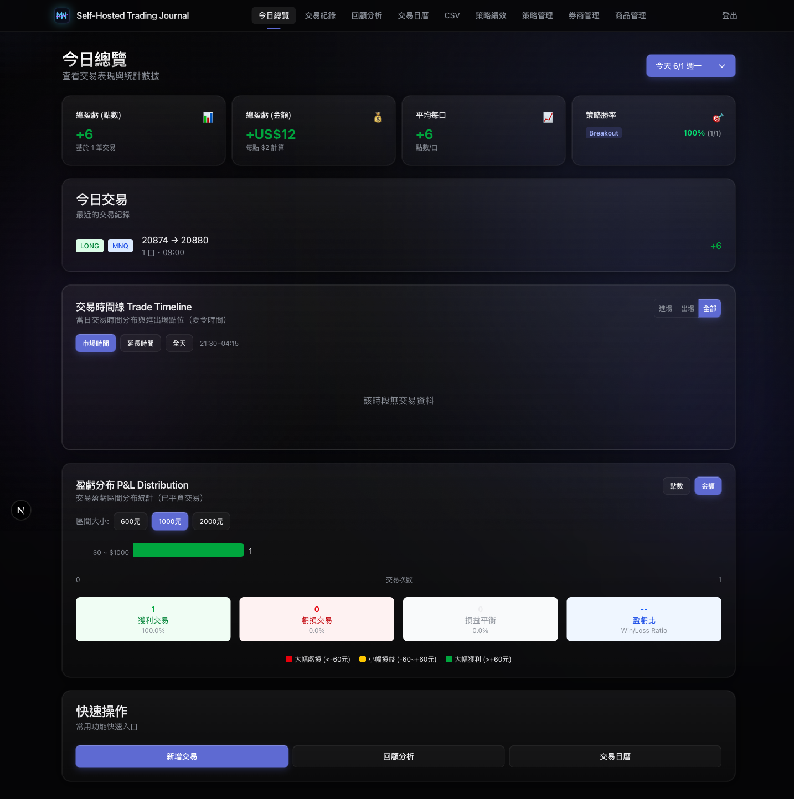
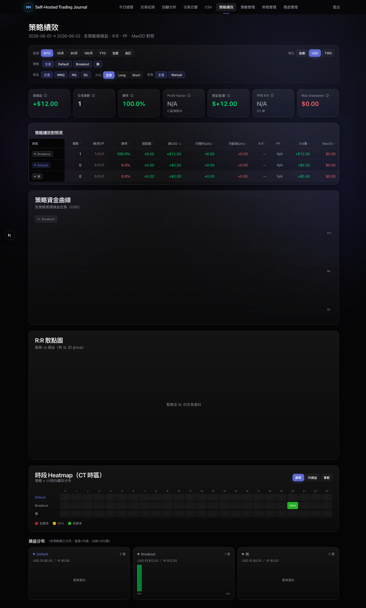
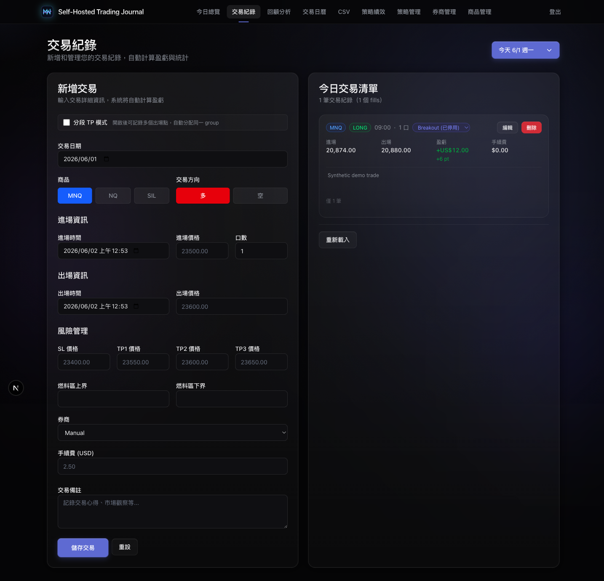
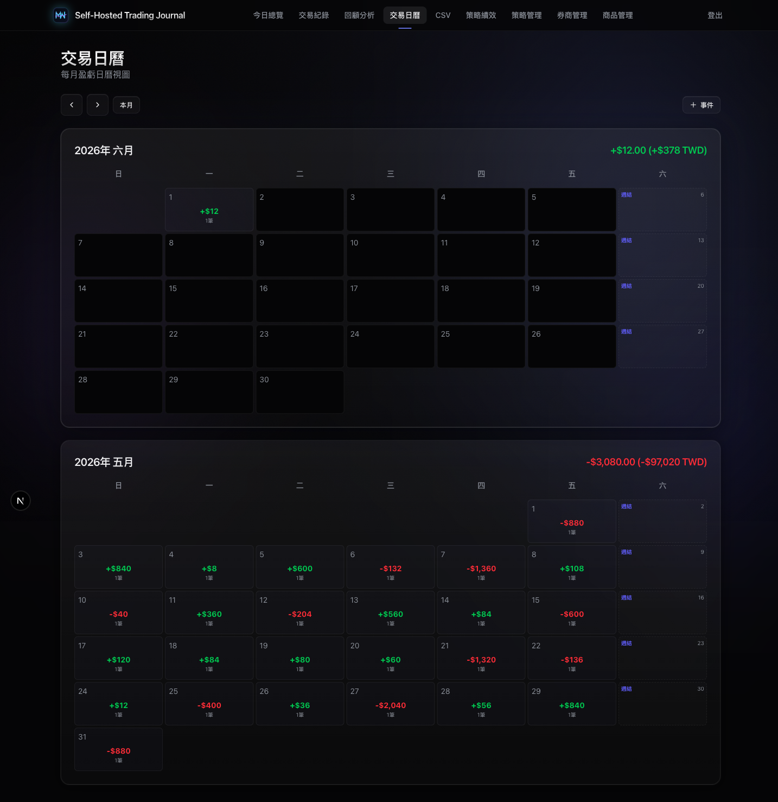

# Self-Hosted Trading Journal

[](https://github.com/Jasper-Tsai/self-hosted-trading-journal/actions/workflows/ci.yml)
[](LICENSE)
[](https://www.typescriptlang.org/)
[](docker-compose.yml)

A privacy-first, local-first trading journal for active futures traders who want to keep broker exports, screenshots, trade notes, and P&L data off third-party SaaS.

It runs on a laptop, private server, or NAS with Next.js, SQLite, and Docker Compose. The public edition is intentionally scoped to reusable self-hosted journaling workflows: trade review, strategy analysis, CSV portability, local authentication, and deployment hygiene.

> This is not a broker, signal service, copy-trading tool, or financial advice product. It is a self-hosted recordkeeping and review application.

## Why This Exists

Active traders often need a journal that can store sensitive screenshots, broker CSV exports, execution notes, and strategy tags. Many hosted journals require uploading that data to a third party. This project provides a self-hosted alternative that is easy to run locally, portable through SQLite, and strict about data ownership.

The goal is to make private trade review practical for individual traders, prop traders, and small teams who prefer NAS/server deployment over SaaS.

## Demo

The screenshots below use synthetic demo data only.

| Dashboard | Strategy Performance |
| --- | --- |
|  |  |

| Trade List | Calendar |
| --- | --- |
|  |  |

## Features

- Trade CRUD with entry/exit, quantity, fees, stops, targets, notes, and strategy labels
- Product and broker configuration from the UI
- P&L, R multiple, win rate, heatmap, calendar, best/worst trades, and strategy performance views
- CSV import/export for portable trade data
- Screenshot/file upload to a local or NAS-mounted volume
- SQLite persistence with automatic first-run schema creation
- Local username/password authentication with signed HTTP-only cookies
- Docker Compose deployment for laptops, home servers, and NAS devices
- CI coverage for audit, lint, tests, production build, Docker image build, and Docker Compose smoke tests

## Quick Start

```bash
npm install
npm run dev
```

Open `http://localhost:3000`.

The app creates `data/db.sqlite` on first run and seeds basic products, a `Manual` broker, and a `Default` strategy.

Default local login:

- Username: `admin`
- Password: `change-me-now`

Change the password before exposing the app outside your own machine or LAN.

To load synthetic demo data:

```bash
npm run seed:demo
```

The demo seed creates local test trades only. It does not include real account, broker, or personal data.

## Docker / NAS Deployment

Create and edit your `.env` first:

```bash
cp .env.example .env
```

Set `JOURNAL_PASSWORD` and `JOURNAL_SESSION_SECRET` to private values before starting the container. Docker Compose intentionally fails closed if these are missing.

```bash
docker compose up -d --build
```

Default URL: `http://localhost:3000`

To run on another host port:

```bash
APP_PORT=3003 docker compose up -d --build
```

Persistent paths:

- `./data` -> SQLite database
- `./uploads` -> uploaded screenshots/files

See [Deployment Guide](docs/DEPLOYMENT.md) for NAS and reverse proxy notes.

## Configuration

Copy the example file if you want to override defaults:

```bash
cp .env.example .env
```

Useful variables:

```bash
APP_BRAND_NAME="Self-Hosted Trading Journal"
APP_PORT=3000
JOURNAL_USERNAME=admin
JOURNAL_PASSWORD=your-private-password
JOURNAL_SESSION_SECRET=replace-with-a-long-random-string
JOURNAL_SECURE_COOKIES=false
DB_PATH="./data/db.sqlite"
UPLOADS_DIR="./uploads"
NEXT_PUBLIC_USD_TWD_RATE=31.5
```

## CSV Import

Use the `/csv` page to import/export trades. Keep sample files synthetic; do not commit real trade exports, screenshots, account IDs, or broker statements.

See [CSV Import Guide](docs/CSV_IMPORT.md) for supported fields and adapter roadmap.

## Security Model

This public edition uses local username/password auth with a signed HTTP-only cookie. It does not connect to Firebase, Google OAuth, or any third-party auth provider.

Before exposing it outside your LAN:

- Change `JOURNAL_PASSWORD`
- Set a long random `JOURNAL_SESSION_SECRET`
- Set `JOURNAL_SECURE_COOKIES=true` when serving only over HTTPS
- Prefer putting it behind NAS/VPN/reverse-proxy auth as an additional layer

Do not commit:

- `.env` files
- `data/`
- `uploads/`
- broker statements or real CSV exports
- screenshots containing account numbers or personal information

See [Threat Model](docs/THREAT_MODEL.md) and [Security Policy](SECURITY.md).

## Maintainer Workflow

This repository is prepared for public maintenance:

- Issues and PRs are enabled
- GitHub Actions verifies audit, lint, tests, build, Docker image, and Docker Compose smoke tests
- Dependabot monitors npm, GitHub Actions, and Docker updates
- Issue templates cover bugs, feature requests, and broker CSV format requests
- The roadmap is tracked in [Roadmap](docs/ROADMAP.md)
- Planned Codex-assisted maintenance workflows are documented in [Codex Usage](docs/CODEX_USAGE.md)

## Development

```bash
npm audit
npm run lint
npm run test
npm run build
docker build -t self-hosted-trading-journal:local .
```

GitHub Actions runs audit, lint, tests, production build, Docker image build, and a Docker Compose smoke test on pushes to `main` and pull requests.

## Project Scope

In scope:

- Self-hosted trading journal workflows
- Local-first privacy and data portability
- CSV import/export
- Docker/NAS deployment
- Strategy and performance review

Out of scope:

- Broker API trading or order execution
- Copy trading, signals, or financial advice
- Cloud-hosted multi-tenant SaaS features
- Maintainer-specific private finance or deployment logic

## Contributing

Please read [Contributing](CONTRIBUTING.md) before opening issues or pull requests.

Use synthetic data in all examples, screenshots, tests, and bug reports.

## License

MIT
